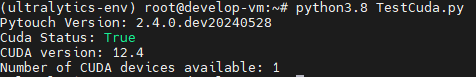

# Raspberry Pi Must Read

If you got This Error `Segmentation fault (core dumped)` Please Read [This](https://github.com/ultralytics/ultralytics/issues/5274)

# Ubuntu Install yolov8 & OpenCV

```bash
pip3 install opencv-python
pip3 install ultralytics
```

# Ubuntu Install Spyder

```bash
sudo apt update
sudo apt install python3-virtualenv
virtualenv -p python3.10 Spyder
source ./Spyder/bin/activate
pip3 install spyder
```

# yolov8 on Anaconda Env Install Windows & Linux

```bash
conda create --name ultralytics-env python=3.8 -y
conda activate ultralytics-env
conda install -c conda-forge opencv -y
conda install -c "conda-forge/label/broken" opencv -y
conda install -c "conda-forge/label/cf201901" opencv -y
conda install -c "conda-forge/label/cf202003" opencv -y
conda install -c "conda-forge/label/gcc7" opencv -y
conda install -c michael_wild opencv-contrib -y
conda install -c conda-forge ultralytics -y
conda install -c pytorch pytorch -y
conda install -c pytorch torchvision -y
conda install -c conda-forge lap -y
conda install -c "conda-forge/label/cf201901" lap -y
conda install -c "conda-forge/label/cf202003" lap -y
conda install -c "conda-forge/label/gcc7" lap -y
conda install -c anaconda numpy -y
conda install spyder-kernels=2.4 -y
conda install -c anaconda ipykernel -y
python -m ipykernel install --user --name=ultralytics-env
```

# YoLov8 on Anaconda Env Install on Linux with CUDA
> [!WARNING]
> Driver Version must >= CUDA Version

> [!NOTE]
> All this Env Test on my VM using VGPU
```bash
conda create --name ultralytics-env python=3.8 -y
conda activate ultralytics-env
conda install -c conda-forge opencv -y
conda install -c "conda-forge/label/broken" opencv -y
conda install -c "conda-forge/label/cf201901" opencv -y
conda install -c "conda-forge/label/cf202003" opencv -y
conda install -c "conda-forge/label/gcc7" opencv -y
conda install -c michael_wild opencv-contrib -y
conda install -c conda-forge ultralytics -y
conda install -c pytorch pytorch -y
conda install -c pytorch torchvision -y
conda install -c conda-forge lap -y
conda install -c "conda-forge/label/cf201901" lap -y
conda install -c "conda-forge/label/cf202003" lap -y
conda install -c "conda-forge/label/gcc7" lap -y
conda install -c anaconda numpy -y
conda install spyder-kernels=2.4 -y
conda install -c anaconda ipykernel -y
conda install pytorch torchvision torchaudio pytorch-cuda=12.4 -c pytorch-nightly -c nvidia
python -m ipykernel install --user --name=ultralytics-env
```

## Example output
